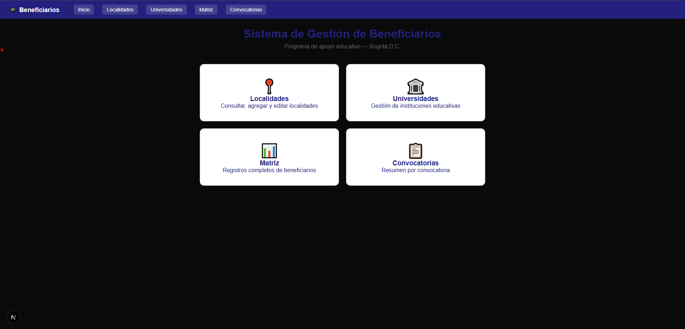
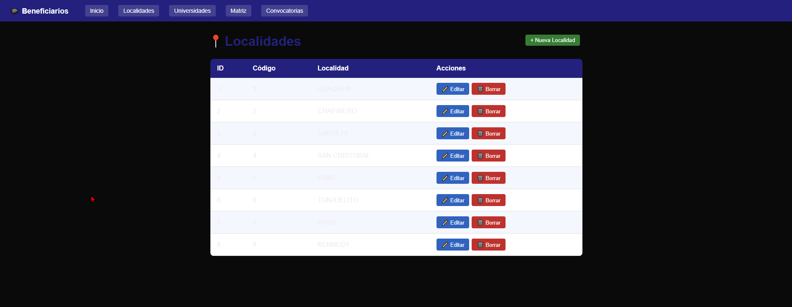
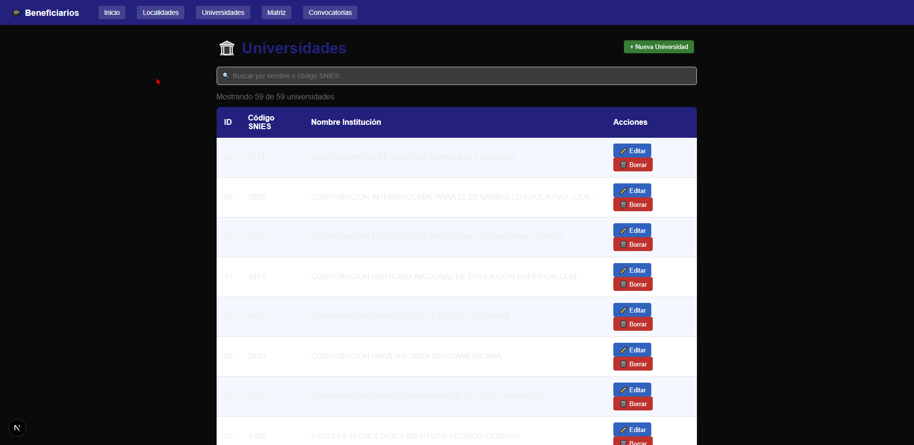
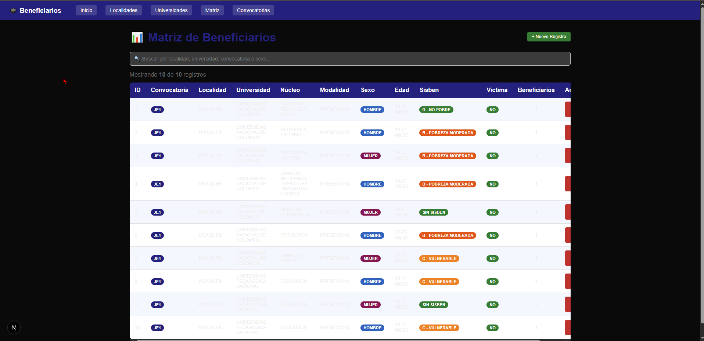
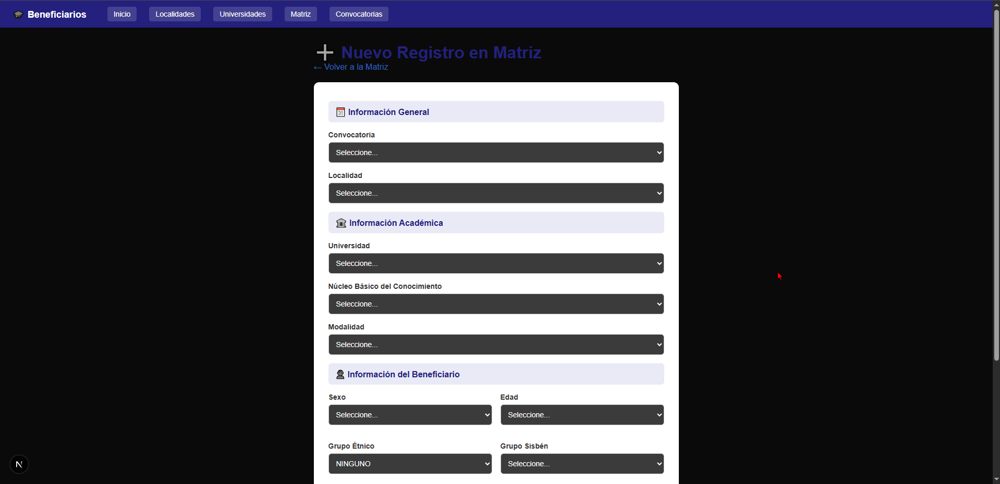
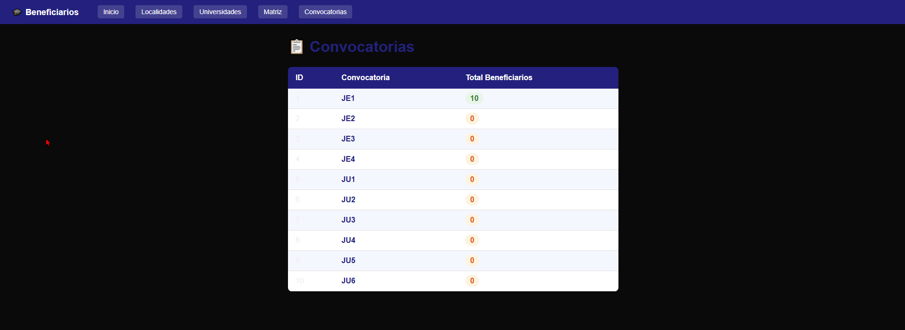

# 🎓 Sistema de Gestión de Beneficiarios
### Programa de Apoyo Educativo — Bogotá D.C.


---

## 📋 Descripción del Proyecto

Sistema web desarrollado con **Next.js** y **MySQL** para la gestión y consulta de beneficiarios del programa de apoyo educativo de Bogotá D.C. Permite registrar, consultar, editar y eliminar información de beneficiarios, universidades, localidades y convocatorias, siguiendo una arquitectura **MVC (Modelo - Vista - Controlador)**.

---

## 🗄️ Base de Datos

La base de datos está alojada en **Railway** y cuenta con **15 tablas**:

| Tabla | Descripción |
|---|---|
| `matriz` | Tabla principal con todos los registros de beneficiarios |
| `convocatoria` | Convocatorias del programa (JE1, JE2... JU6) |
| `localidad` | Localidades de Bogotá |
| `universidades` | 59 instituciones de educación superior |
| `nucleo_conocimiento` | Núcleos básicos del conocimiento |
| `modalidad` | Modalidades académicas |
| `sexo` | Género del beneficiario |
| `edad` | Rangos de edad |
| `grupo_etnico` | Grupos étnicos |
| `sisben` | Clasificación Sisbén |
| `victima_conflicto` | Víctima del conflicto armado |
| `discapacidad` | Condición de discapacidad |
| `saber_11` | Percentil Pruebas Saber 11 |
| `zona` | Zona geográfica |
| `sector_colegio` | Sector del colegio de procedencia |

---

## 🏗️ Arquitectura MVC

mi-app-beneficiarios/
├── db/
│   └── connection.js          → Conexión Pool MySQL (Railway)
├── models/
│   ├── localidadModel.js      → CRUD Localidades
│   ├── universidadModel.js    → CRUD Universidades
│   ├── matrizModel.js         → Consulta + Insert + Delete Matriz
│   └── convocatoriaModel.js   → Consulta Convocatorias
├── app/
│   ├── api/                   → Controladores (Rutas API REST)
│   │   ├── localidades/
│   │   ├── universidades/
│   │   ├── matriz/
│   │   ├── convocatorias/
│   │   └── catalogos/
│   ├── localidades/           → Vistas Localidades
│   ├── universidades/         → Vistas Universidades
│   ├── matriz/                → Vistas Matriz
│   ├── convocatorias/         → Vistas Convocatorias
│   ├── layout.js              → Navegación Global
│   └── page.js                → Página de Inicio

---

## ✅ Funcionalidades

| Módulo | Consulta | Insertar | Editar | Eliminar |
|---|:---:|:---:|:---:|:---:|
| Localidades | ✅ | ✅ | ✅ | ✅ |
| Universidades | ✅ | ✅ | ✅ | ✅ |
| Matriz de Beneficiarios | ✅ | ✅ | ❌ | ✅ |
| Convocatorias | ✅ | ❌ | ❌ | ❌ |

---

## 📸 Pantallazos del Sistema

### 🏠 Página de Inicio


### 📍 Gestión de Localidades


### 🏛️ Gestión de Universidades


### 📊 Matriz de Beneficiarios


### ➕ Nuevo Registro en Matriz


### 📋 Convocatorias


---

## 🚀 Cómo ejecutar el proyecto localmente

### 1. Clonar el repositorio
```bash
git clone https://github.com/MrOlaya666/mi-app-beneficiarios.git
cd mi-app-beneficiarios
```

### 2. Instalar dependencias
```bash
npm install
```

### 3. Configurar variables de entorno
Crea un archivo `.env.local` en la raíz del proyecto:

### 4. Ejecutar en desarrollo
```bash
npm run dev
```

### 5. Abrir en el navegador

---

## 🛠️ Tecnologías Utilizadas

- **Frontend:** Next.js 15, React, CSS Modules
- **Backend:** Next.js API Routes (App Router)
- **Base de Datos:** MySQL en Railway
- **Conector:** mysql2
- **Arquitectura:** MVC (Modelo - Vista - Controlador)
- **Control de Versiones:** Git + GitHub

---

## 👨‍💻 Desarrollado por

**MrOlaya666**
Proyecto académico ADSO — 2026
Bogotá D.C., Colombia 🇨🇴


